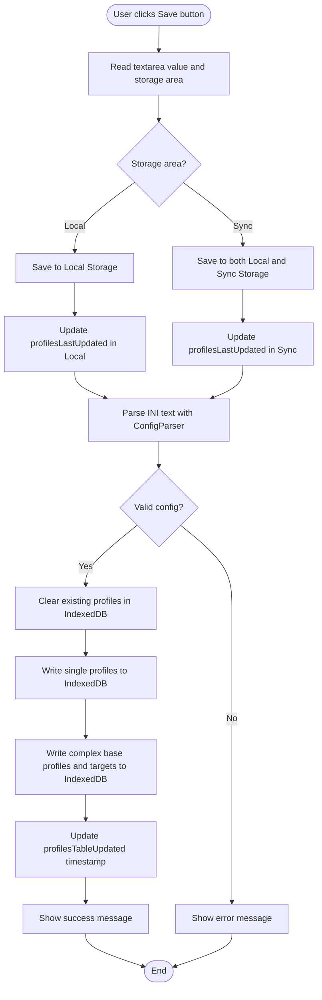
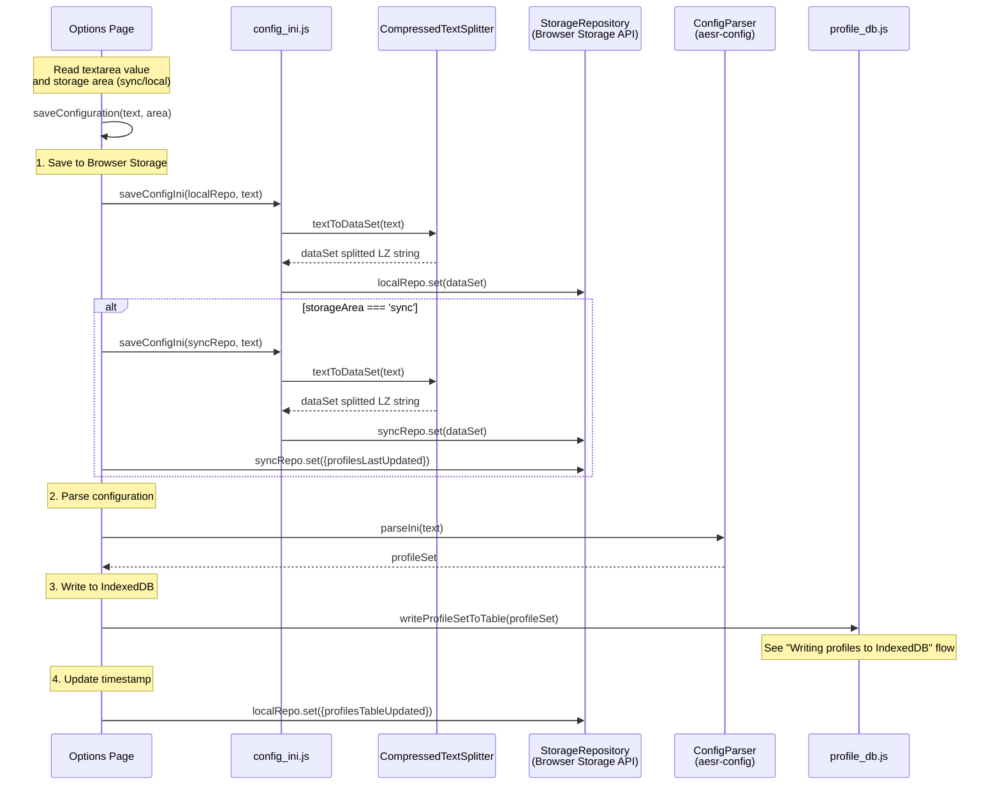
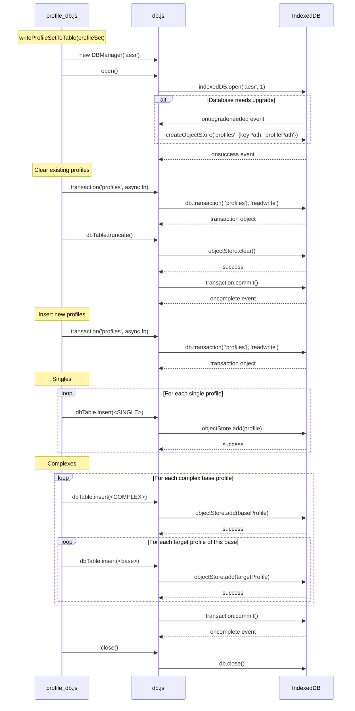

# Saving profiles

## Overview flowchart

```mermaid
flowchart TD
    Start([User clicks Save button]) --> ReadInput[Read textarea value and storage area]
    ReadInput --> SaveStorage{Storage area?}
    
    SaveStorage -->|Local| SaveLocal[Save to Local Storage]
    SaveStorage -->|Sync| SaveBoth[Save to both Local and Sync Storage]
    
    SaveLocal --> UpdateTimestamp1[Update profilesLastUpdated in Local]
    SaveBoth --> UpdateTimestamp2[Update profilesLastUpdated in Sync]
    
    UpdateTimestamp1 --> Parse[Parse INI text with ConfigParser]
    UpdateTimestamp2 --> Parse
    
    Parse --> ValidConfig{Valid config?}
    ValidConfig -->|No| ShowError[Show error message]
    ValidConfig -->|Yes| ClearDB[Clear existing profiles in IndexedDB]
    
    ClearDB --> WriteSingles[Write single profiles to IndexedDB]
    WriteSingles --> WriteComplexes[Write complex base profiles and targets to IndexedDB]
    WriteComplexes --> UpdateTableTS[Update profilesTableUpdated timestamp]
    UpdateTableTS --> ShowSuccess[Show success message]
    ShowSuccess --> End([End])
    ShowError --> End
```

## Main sequence dialog

```mermaid
sequenceDiagram
    participant Options as Options Page
    participant ConfigIni as config_ini.js
    participant Compressor as CompressedTextSplitter
    participant Storage as StorageRepository<br/>(Browser Storage API)
    participant ConfigParser as ConfigParser<br/>(aesr-config)
    participant ProfileDB as profile_db.js

    Note over Options: Read textarea value<br/>and storage area (sync/local)
    
    Options->>Options: saveConfiguration(text, area)
    
    Note over Options: 1. Save to Browser Storage
    Options->>ConfigIni: saveConfigIni(localRepo, text)
    ConfigIni->>Compressor: textToDataSet(text)
    Compressor-->>ConfigIni: dataSet splitted LZ string
    ConfigIni->>Storage: localRepo.set(dataSet)
    
    alt storageArea === 'sync'
        Options->>ConfigIni: saveConfigIni(syncRepo, text)
        ConfigIni->>Compressor: textToDataSet(text)
        Compressor-->>ConfigIni: dataSet splitted LZ string
        ConfigIni->>Storage: syncRepo.set(dataSet)
        
        Options->>Storage: syncRepo.set({profilesLastUpdated})
    end
    
    Note over Options: 2. Parse configuration
    Options->>ConfigParser: parseIni(text)
    ConfigParser-->>Options: profileSet
    
    Note over Options: 3. Write to IndexedDB
    Options->>ProfileDB: writeProfileSetToTable(profileSet)
    Note over ProfileDB: See "Writing profiles to IndexedDB" flow
    
    Note over Options: 4. Update timestamp
    Options->>Storage: localRepo.set({profilesTableUpdated})
```

## Writing profiles to IndexedDB sequence dialog

```mermaid
sequenceDiagram
    participant ProfileDB as profile_db.js
    participant DBManager as db.js
    participant IndexedDB as IndexedDB

    Note over ProfileDB: writeProfileSetToTable(profileSet)
    
    ProfileDB->>DBManager: new DBManager('aesr')
    ProfileDB->>DBManager: open()
    DBManager->>IndexedDB: indexedDB.open('aesr', 1)
    
    alt Database needs upgrade
        IndexedDB->>DBManager: onupgradeneeded event
        DBManager->>IndexedDB: createObjectStore('profiles', {keyPath: 'profilePath'})
    end
    
    IndexedDB-->>DBManager: onsuccess event
    
    Note over ProfileDB: Clear existing profiles
    ProfileDB->>DBManager: transaction('profiles', async fn)
    DBManager->>IndexedDB: db.transaction(['profiles'], 'readwrite')
    IndexedDB-->>DBManager: transaction object
    ProfileDB->>DBManager: dbTable.truncate()
    DBManager->>IndexedDB: objectStore.clear()
    IndexedDB-->>DBManager: success
    DBManager->>IndexedDB: transaction.commit()
    IndexedDB-->>DBManager: oncomplete event
    
    Note over ProfileDB: Insert new profiles
    ProfileDB->>DBManager: transaction('profiles', async fn)
    DBManager->>IndexedDB: db.transaction(['profiles'], 'readwrite')
    IndexedDB-->>DBManager: transaction object
    
    Note over ProfileDB: Singles
    loop For each single profile
        ProfileDB->>DBManager: dbTable.insert(<SINGLE>)
        DBManager->>IndexedDB: objectStore.add(profile)
        IndexedDB-->>DBManager: success
    end
    
    Note over ProfileDB: Complexes
    loop For each complex base profile
        ProfileDB->>DBManager: dbTable.insert(<COMPLEX>)
        DBManager->>IndexedDB: objectStore.add(baseProfile)
        IndexedDB-->>DBManager: success
        
        loop For each target profile of this base
            ProfileDB->>DBManager: dbTable.insert(<base>)
            DBManager->>IndexedDB: objectStore.add(targetProfile)
            IndexedDB-->>DBManager: success
        end
    end
    
    DBManager->>IndexedDB: transaction.commit()
    IndexedDB-->>DBManager: oncomplete event
    
    ProfileDB->>DBManager: close()
    DBManager->>IndexedDB: db.close()
```
